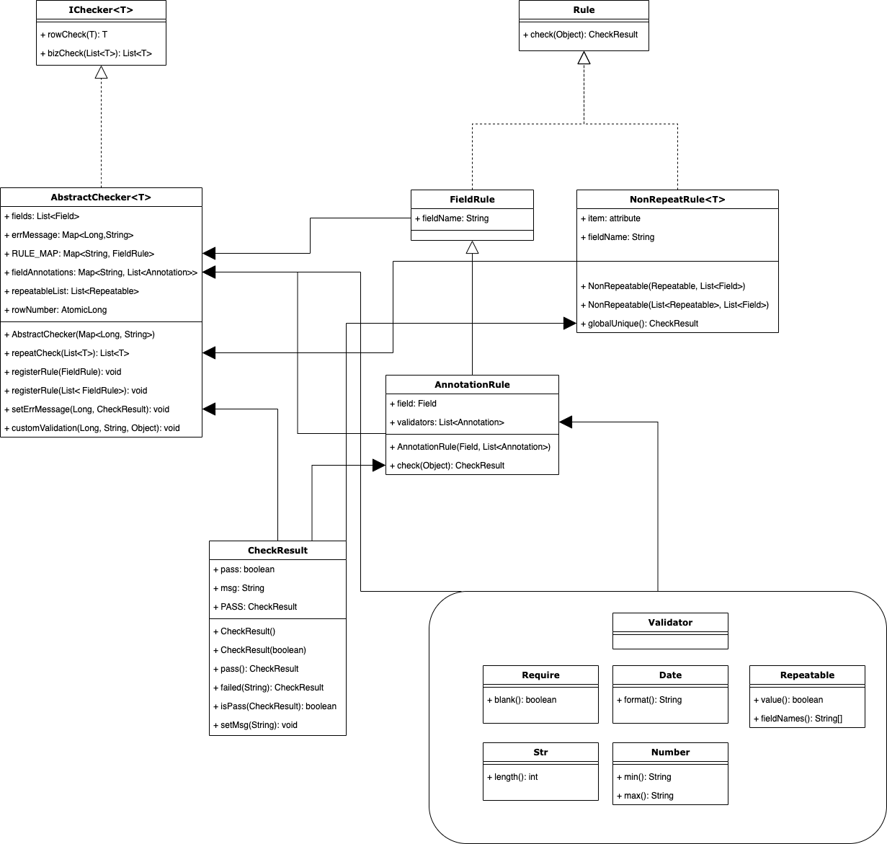

# 导入文件数据校验

## 〇

​		在工作中数据文件导入是一个绕不开的业务，最为常见的数据文件比如：Excel与CSV。数据导入相对比较麻烦的工作是需要对导入数据进行校验。结合实际导入业务总结出本项目：使用注解与自定义校验器来实现数据自动校验，简化数据导入工作。

## 一、主要类关系图



## 二、使用说明

### 2.1 主要类说明

目前类主要分为三个部分：`Checker、Rule、Annotation`

**Checker:** 校验器，使用时需要自定义导入数据类型的校验器并继承该类

**Rule:** 校验规则，提供两个默认的校验规则——AnnotationRule、NonRepeatRule

​		AnnotationRule: 默认注解的校验规则，解析字段所标注的校验注解，并按照注解方法规则校验数据合法性

​		NonRepeatRule: 字段非重复校验，支持单个字段与多个字段关联校验

​		other: 自定义校验规则，需要实现Rule接口，目前只支持字段级别的自定义校验规则

**Annotation:** 校验注解，自定义的校验注解需要使用Validator注解修饰，校验流程会读取所有标注了Validator注解的注解

另外还有一个校验结果类`CheckResult`，该类提供两个重要参数——校验结果、错误信息

### 2.2 使用方法

该校验框架结合EasyExcel使用更为方便，在自定义的ReadListener中创建自定义校验器xxChecker传入错误信息容器Map，读取每行数据的时候调用xxChecker的rowCheck方法，在读取完所有数据之后调用xxChecker的repeatCheck方法。

```java
public void upload(List<Student> studentList) {
				// 创建错误信息Map
        Map<Long, String> errMsgMap = new HashMap<>();
  			// 创建自定义Checker
        StudentChecker studentChecker = new StudentChecker(errMsgMap);
  
  			// 模拟读取每行数据时进行的RowCheck
        for (Student student : studentList) {
            studentChecker.rowCheck(student);
        }

  			// 模拟数据读取完毕之后进行数据重复检测
        studentChecker.repeatCheck(studentList);

  			// 打印错误信息
        for (Map.Entry<Long, String> longStringEntry : errMsgMap.entrySet()) {
            String errMsg = String.format("第 %d 行数据, 错误信息: %s", longStringEntry.getKey(), longStringEntry.getValue());
            System.out.println(errMsg);
        }
    }
```

